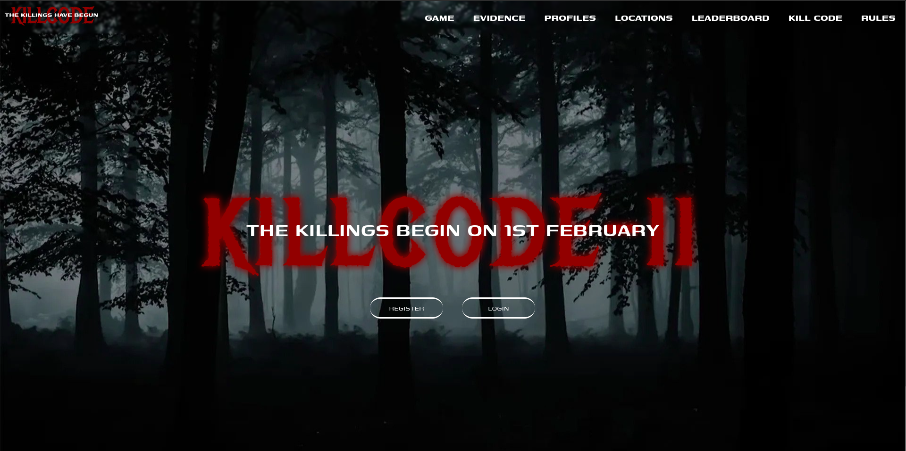

# KILLCODE 2.0

Killcode 2.0 is one of the flagship events of Debating Society NIT Durgapur. This repo contains the frontend of the the quiz application.The project was created using React Js for frontend and the backend is in Django.

## ` How it works `

  1.Basic email password authentication \
  2.Time based rounds \
  3.Round wise clues \
  4.Locations

